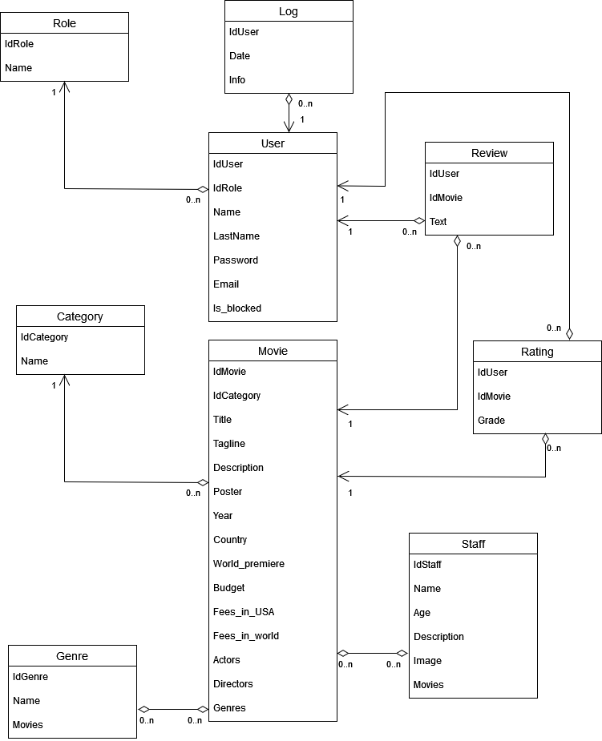
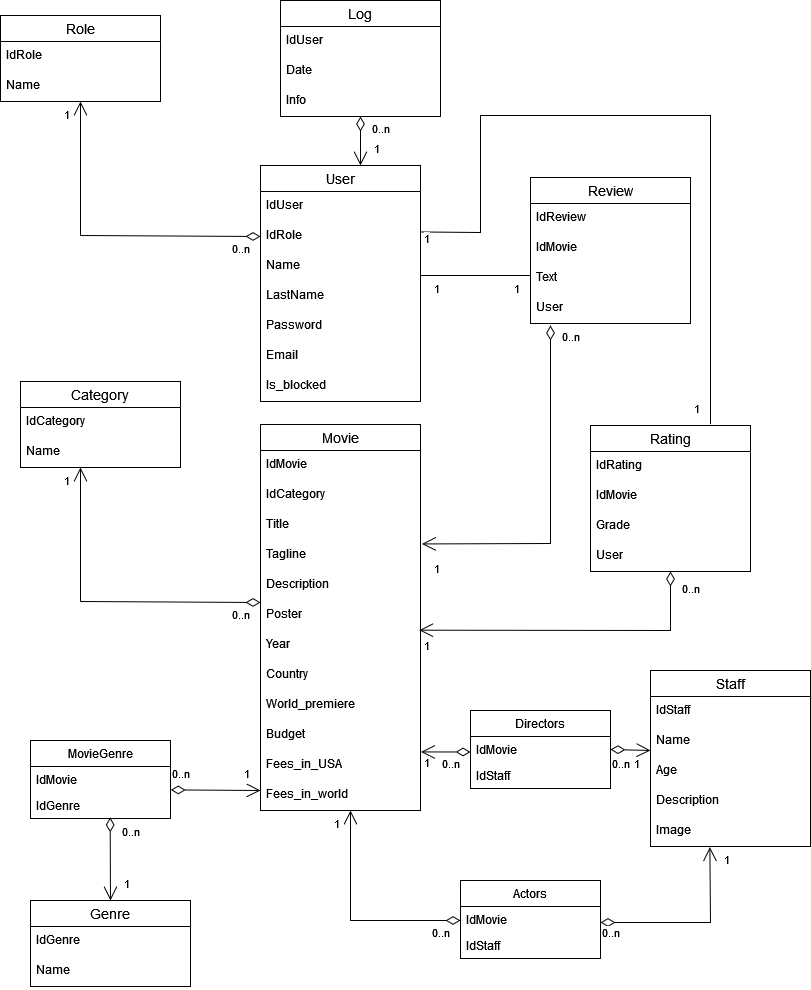

## Requirements:
1. User roles:
   - default
   - moderator
   - admin
---
1. Default user:
   - authentification
   - leave a review for the movie
   - rate the movie
2. Moderator:
   - delete reviews
   - edit and add movies, actors
3. Admin:
   - same as moderator and block user
---
Database diagram:

---
Database description:

**Highlighted** fields are primary keys or part of them

- User - all users
   - **IdUser** - uuid
   - IdRole - uuid(foreign key)
   - Name - varchar(user name)
   - LastName - varchar(user last name)
   - Password - varchar(user password)
   - Email - varchar(user email)
   - Is_blocked - bool(is the user blocked or not)

- Role - roles for users
   - **IdRole** - uuid
   - Name - varchar(role name)
- Log - user action logs
   - **IdUser** - uuid(foreign key)
   - Date - time(time of user action)
   - Info - varchar(user action for log)

- Review - movie review
   - **IdUser** - uuid(foreign key)
   - **IdMovie** - uuid(foreign key)
   - Text - varchar(movie review text)

- Rating - movie rating
   - **IdUser** - uuid(foreign key)
   - **IdMovie** - uuid(foreign key)
   - Grade - int(movie rating from 1 to 10)

- Category - movie category
   - **IdCategory** - uuid
   - Name - varchar(category name)

- Movie
   - **IdMovie** - uuid
   - IdCategory - uuid(foreign key)
   - Title - varchar(movie title)
   - Tagline - varchar(movie tagline)
   - Description - varchar(movie description)
   - Poster - varchar(movie poster image path)
   - Year - int(movie release year)
   - Country - varchar(movie production country)
   - World_premiere - time(movie release date)
   - Budget - int(movie production budget)
   - Fees_in_USA - int(fees in USA)
   - Fees_in_world - int(fees in the world)

- Actors - many to many table between movie and staff
   - **IdStaff** - uuid(foreign key)
   - **IdMovie** - uuid(foreign key)

- Directors - many to many table between movie and staff
   - **IdStaff** - uuid(foreign key)
   - **IdMovie** - uuid(foreign key)

- MovieGenre - many to many table between movie and genre
   - **IdGenre** - uuid(foreign key)
   - **IdMovie** - uuid(foreign key)

- Genre - movie genre
   - **IdGenre** - uuid
   - Name - varchar(genre name)

- Staff - movie staff
   - **IdStaff** - uuid
   - Name - varchar(staff member name)
   - Age - int(staff member age)
   - Description - varchar(staff member description)
   - Image - varchar(staff member image path)
---
Normalized database:

